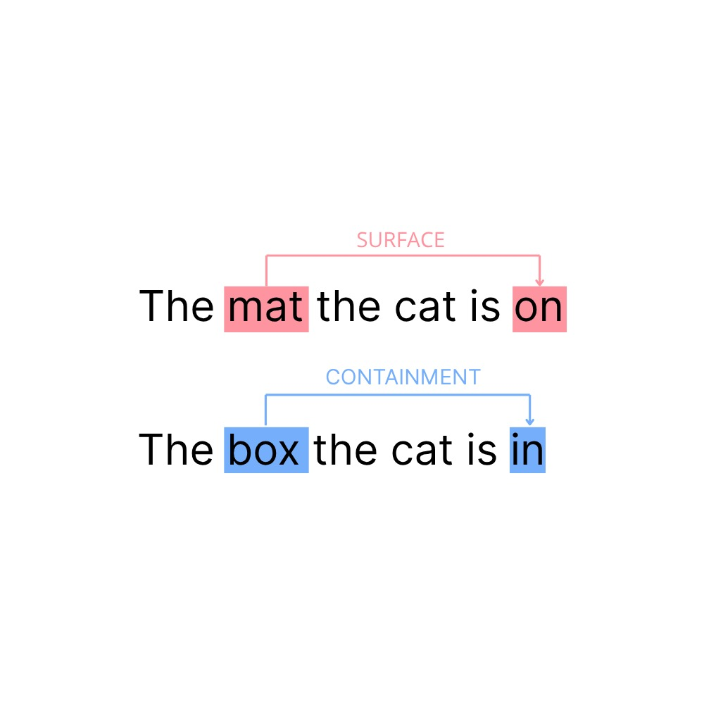

## Mechanistic Interpretability Meets Cognitive Linguistics: Modelling *Image Schemas* in the Circuit Framework



### Abstract
Large Language Models are often considered the best computational testbeds for linguistic theorisation at our disposal. However, their inner workings remain largely opaque, and the mechanisms behind their behaviour cannot always be easily connected with theoretical linguistic assumptions. Mechanistic Interpretability (MI) is surging as a specialised field to reverse engineer models’ internals and shed light on the causal relationships happening under the hood. Nevertheless, MI is predominantly focused on AI-Safety problems, and the attempts to understand linguistically motivated behaviours with these tools are still limited. In this work, we investigate whether an LLM, namely LlaMA-3.2-1b, has developed specialised mechanisms governing the selection of the locative preposition in simple copular clauses. To frame the problem as a next-token prediction objective, we introduce the Stranded Locative Preposition Selection task along with a small dataset aptly curated to test it. We make use of several MI tools to scan the model’s internals and relate their mechanisms to classic theory in Cognitive Linguistics, which assumes that the two basic locative repositions in and on are the respective linguistic encoding of two different Image Schemas: Containment and Surface.

<!--  -->


```
find_circuit.py: isolate meaningful circuits. best_circ finds circuits on a given threshold. --trend compute all circuits under a threshold.
```
``` 
templates_overlap.py: compute IoU and Edge recall between circuits pairs and common compontents intersection among circuits. If --only_core is passed compute only common intersection.
```

```
cross_template_faith.py: compute performance of each given template-circuit  and common circuit against all others.
If --only_core is passed compute only common circuit against all templates.
```

```python
python activation_patching.py
```