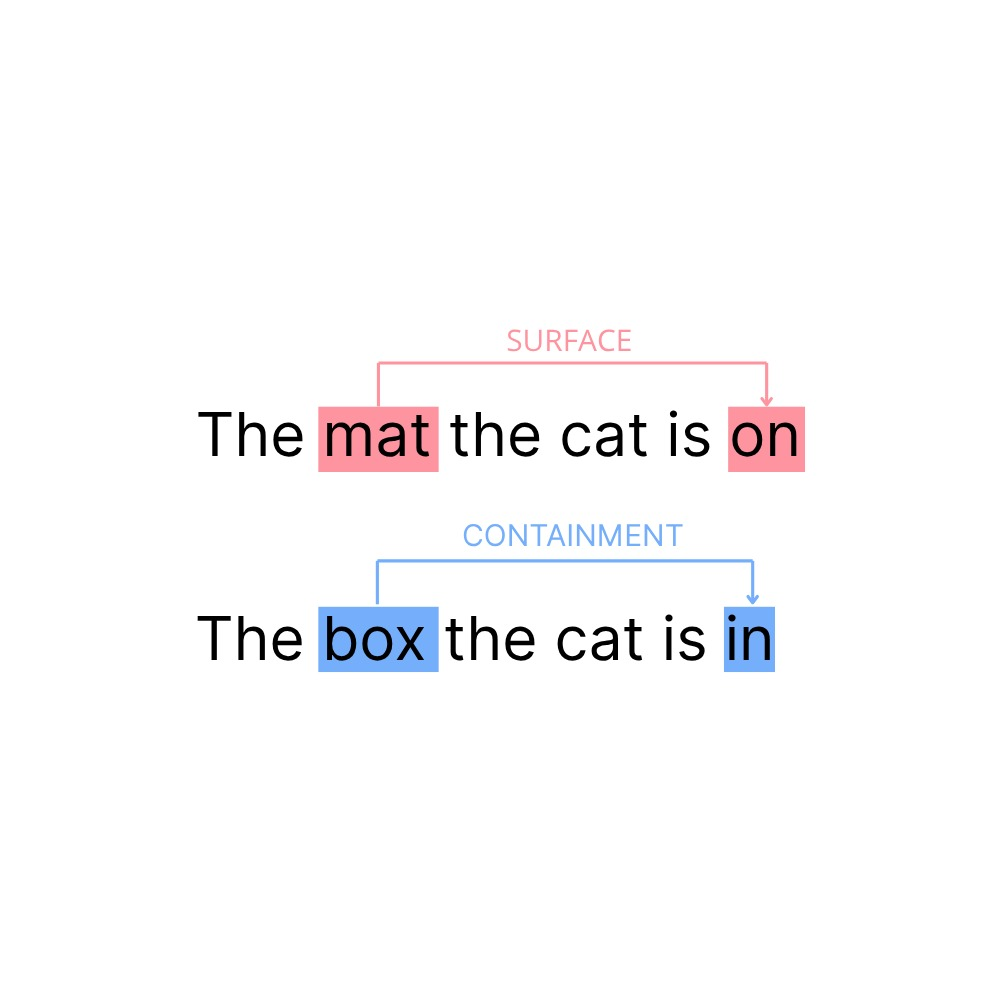

## Mechanistic Interpretability Meets Cognitive Linguistics: Modelling *Image Schemas* in the Circuit Framework



### Abstract
Large Language Models are often considered the best computational testbeds for linguistic theorisation at our disposal. However, their inner workings remain largely opaque, and the mechanisms behind their behaviour cannot always be easily connected with theoretical linguistic assumptions. Mechanistic Interpretability (MI) is surging as a specialised field to reverse engineer models’ internals and shed light on the causal relationships happening under the hood. Nevertheless, MI is predominantly focused on AI-Safety problems, and the attempts to understand linguistically motivated behaviours with these tools are still limited. In this work, we investigate whether an LLM, namely LlaMA-3.2-1b, has developed specialised mechanisms governing the selection of the locative preposition in simple copular clauses. To frame the problem as a next-token prediction objective, we introduce the Stranded Locative Preposition Selection task along with a small dataset aptly curated to test it. We make use of several MI tools to scan the model’s internals and relate their mechanisms to classic theory in Cognitive Linguistics, which assumes that the two basic locative repositions in and on are the respective linguistic encoding of two different Image Schemas: Containment and Surface.

<!--  -->


### Scripts and Example Usage

Run commands from the repository root.

find_circuit.py: isolate meaningful circuits.
- best_circ mode (default): find circuits around a target performance threshold.
- trend mode: compute performance across a full edge-retention trend.

```bash
python scripts/find_circuit.py --model llama3.2-1b
python scripts/find_circuit.py --model llama3.2-1b --method best_circ --threshold 86 --decrease_factor 1000 30000 1000
python scripts/find_circuit.py --model llama3.2-1b --method trend --decrease_factor 1000 30000 1000
```

templates_overlap.py: compute IoU and Edge Recall between template circuits, and compute common components.

```bash
python scripts/templates_overlap.py --model llama3.2-1b
python scripts/templates_overlap.py --model llama3.2-1b --only_core
```

cross_template_faith.py: compute cross-template faithfulness for each template-circuit and for the common core circuit.

```bash
python scripts/cross_template_faith.py --model llama3.2-1b
python scripts/cross_template_faith.py --model llama3.2-1b --only_core
```

activation_patching.py: run activation patching analyses and save per-template patching tensors.

```bash
python scripts/activation_patching.py --model llama3.2-1b
```